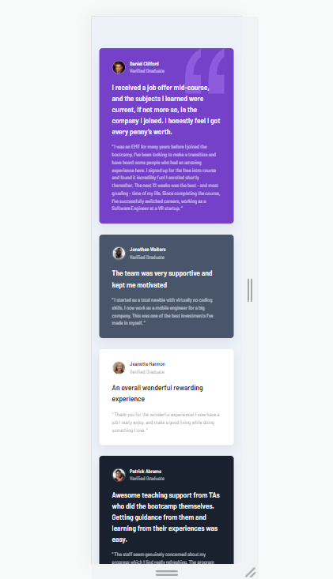
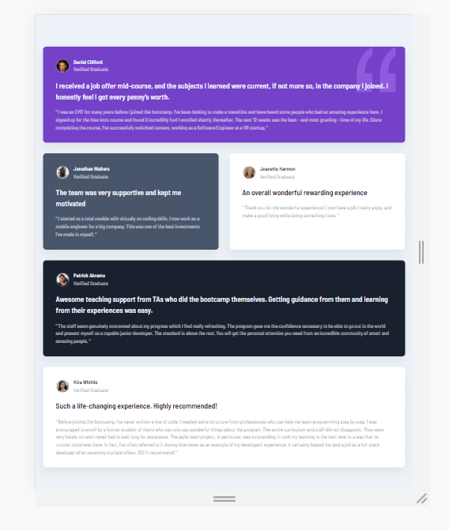
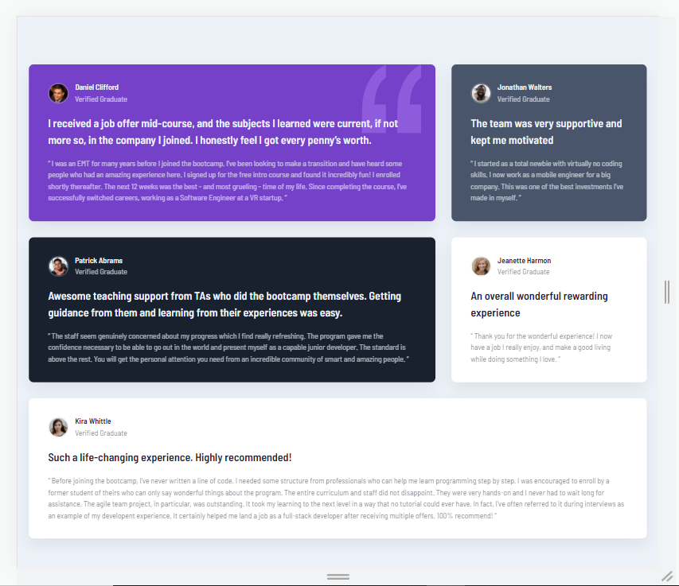

# Frontend Mentor - Testimonials grid section solution

This is a solution to the [Testimonials grid section challenge on Frontend Mentor](https://www.frontendmentor.io/challenges/testimonials-grid-section-Nnw6J7Un7). Frontend Mentor challenges help you improve your coding skills by building realistic projects.

## Table of contents

- [Overview](#overview)
  - [The challenge](#the-challenge)
  - [Screenshot](#screenshot)
  - [Links](#links)
- [My process](#my-process)
  - [Built with](#built-with)
  - [What I learned](#what-i-learned)
  - [Continued development](#continued-development)
  - [Useful resources](#useful-resources)
- [Author](#author)

## Overview

### The challenge

Users should be able to:

- View the optimal layout for the site depending on their device's screen size

### Screenshot





### Links

- Solution URL: https://github.com/Stephenseun09/Css-Grids/
- Live Site URL: https://stephenseun09.github.io/Css-Grids/

## My process

### Built with

- Semantic HTML5 markup
- CSS custom properties
- Flexbox
- CSS Grid
- Mobile-first workflow

### What I learned

Advanced CSS Grids.
I have always used CSS FlexBox for my designs and for the very first time, i practised using advanced css grids.
As seen below, i demonstrated how you can use css grids without having to write much media queries.
It is quite liovely.
I'm in love in Css Grids

```css
main {
  grid: auto-flow min-content / repeat(3, 1fr);
  grid-template-areas:
    "card1 card1 card2"
    "card4 card4 card3"
    "card5 card5 card5";
}
.card1 {
  grid-area: card1;
}
.card2 {
  grid-area: card2;
}
.card3 {
  grid-area: card3;
}
.card4 {
  grid-area: card4;
}
.card5 {
  grid-area: card5;
}
```

### Continued development

I'm going to look into Css Subgrids for now, and hope that it'll be compatible with major browsers very soon

### Useful resources

- [Advance CSS Grid Layout](https://www.pluralsight.com) - This helped me a lot with Grid layout. It's a great pattern and I will use it going forward.

## Author

- Website - [Stephen Arogundade](https://www.your-site.com)
- Frontend Mentor - [@Stephenseun09](https://www.frontendmentor.io/profile/stephenseun09)
- Twitter - [@StephenASG](https://www.twitter.com/stephenasg)
